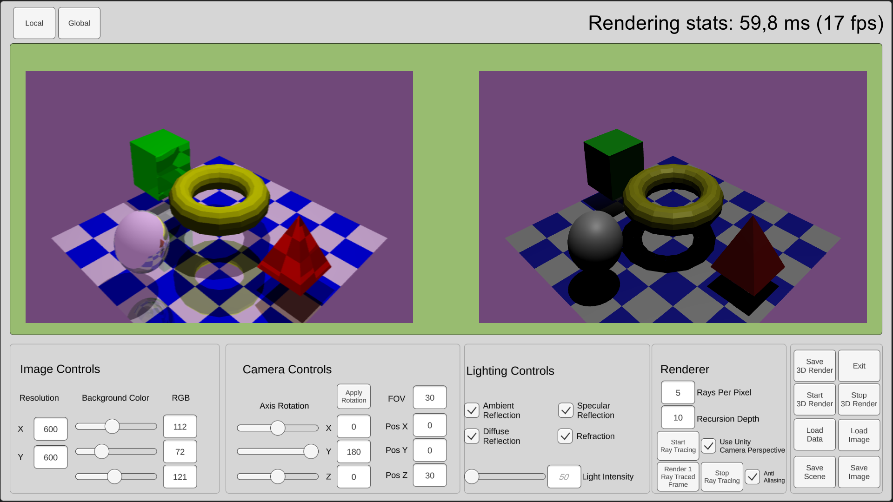

# Unity GPU Accelerated Raytracer

A Ray Tracer built in Unity using compute shaders. It was built as a project for the Graphical Systems curricular unit.

It uses a compute shader to write the ray traced image directly to a RenderTexture. Heavily inspired by Sebastian Lague Ray Tracing in Unity videos.

## Installation

First, make sure you have Unity installed with one of the 2022.3.x LTS versions.
> If you are using Unity 6, I believe the project should run without issues/with minimal fixes.

## Running the application

There are some scene configuration files (in Resources/Config) that are used to build the 3D objects present in the game world. They are also present alongside the executable, so you can modify them to alter the objects in each scene. The configuration files' structure and data as given by the professor, so we could not modify it.

Use the UI buttons to load the scene and modify it in real time!
> Sometimes the application can run slowly, so tweak the settings(image size, lighting settings) if you experience slow downs.

If your changes to the lighting controls are not being displayed, make sure to press the "Local" button and now your changes will affect the scene!
To modify the configuration file used, go to "Assets/Resources/Config" and change the desired filename to "TestScene.txt". The same is applied to the image used for comparision, located in "Assets/SavedImages/3DRenders".
All images are saved to either "Assets/SavedImages/3DRenders" or "Assets/SavedImages/RayTracedImages", depending on how they were generated. They are saved under the following name format: "screenshot_{yyyy-MM-dd-HH-mm-ss}.png".

## Known Issues
- Eliptical objects are ray traced as spherical objects
 
## License

MIT License

Copyright (c) 2025 Pedro Campião

Permission is hereby granted, free of charge, to any person obtaining a copy
of this software and associated documentation files (the "Software"), to deal
in the Software without restriction, including without limitation the rights
to use, copy, modify, merge, publish, distribute, sublicense, and/or sell
copies of the Software, and to permit persons to whom the Software is
furnished to do so, subject to the following conditions:

The above copyright notice and this permission notice shall be included in all
copies or substantial portions of the Software.

THE SOFTWARE IS PROVIDED "AS IS", WITHOUT WARRANTY OF ANY KIND, EXPRESS OR
IMPLIED, INCLUDING BUT NOT LIMITED TO THE WARRANTIES OF MERCHANTABILITY,
FITNESS FOR A PARTICULAR PURPOSE AND NONINFRINGEMENT. IN NO EVENT SHALL THE
AUTHORS OR COPYRIGHT HOLDERS BE LIABLE FOR ANY CLAIM, DAMAGES OR OTHER
LIABILITY, WHETHER IN AN ACTION OF CONTRACT, TORT OR OTHERWISE, ARISING FROM,
OUT OF OR IN CONNECTION WITH THE SOFTWARE OR THE USE OR OTHER DEALINGS IN THE
SOFTWARE.
